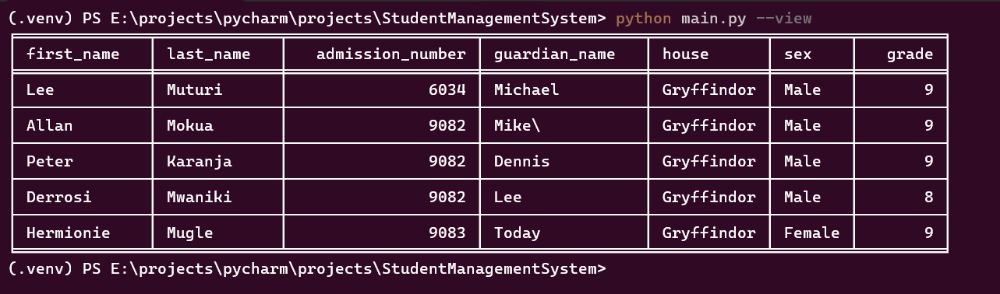

# Student Management System

## Overview
The Student Management System is a Python-based application that allows users to add and view student records. The records are stored in a CSV file named `students.csv`.

## Prerequisites
- Python 3.x
- Required Python packages: `tabulate`

You can install the required package using pip:
```sh
pip install tabulate
```
## Usage
The application can be run from the command line with the following options:

### Adding a Student
To add a student, use the --add option:

```sh
python main.py --add
```
You will be prompted to enter the following details:

- First Name
- Last Name
- Admission Number (must be an integer)
- Guardian Name
- House (must be one of Gryffindor, Slitherin, RavenClaw)
- Gender
- Grade (must be an integer)

</img>

### Viewing Students
To view all students, use the --view option:
```sh
python main.py --view
```
This will display the student records in a tabulated format
</img>

## File Structure

- `main.py`: The main script to run the application.
- `student.py`: Contains the Student class and helper functions.
- `students.csv`: The CSV file where student records are stored.

## Example
Adding a student:
```sh
python main.py --add
```
Follow the prompts to enter the student details.

Viewing students:
```sh
python main.py --view
```
This will display the list of students in a formatted table.

### Notes

- Ensure the `students.csv` file is in the same directory as the scripts.
- The application will create the `students.csv` file if it does not exist.